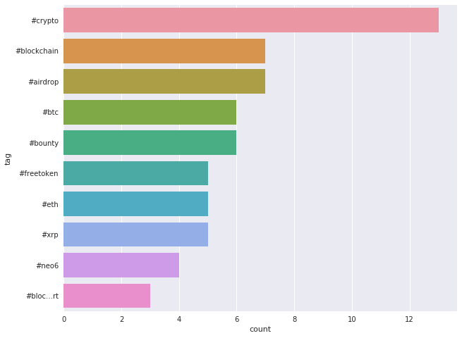

# Big Data: Ejercicio con Spark Streaming.

----
### Recordando la Arquitectura Lambda


1. All data entering the system is dispatched to both the batch layer and the speed layer for processing.

1. The batch layer has two functions: (i) managing the master dataset (an immutable, append-only set of raw data), and (ii) to pre-compute the batch views.

1. The serving layer indexes the batch views so that they can be queried in low-latency, ad-hoc way.

1. The speed layer compensates for the high latency of updates to the serving layer and deals with recent data only.
Any incoming query can be answered by merging results from batch views and real-time views.
----
## Indicaciones para la primera parte

### Iniciar Docker
### Eliminar todos los contenedores creados en clases anteriores
### Copiar los ejemplos para hoy:
- https://github.com/cerouno-examples/cerouno-ds
- https://github.com/israelzuniga/cerouno-ds-israelzuniga

### Crear un nuevo contenedor de PySpark:
Primero, nos situamos en el directorio donde tengamos nuestro código para hoy.

```bash
docker run -e GRANT_SUDO=yes --user root -p 8888:8888 -p 4040:4040 -v $PWD:/home/jovyan/work jupyter/pyspark-notebook start-notebook.sh
```
Problemas con Windows:
* https://medium.com/@neil.avery_68603/running-docker-from-windows-cmd-prompt-6540daebedad#.lae8p2oiz
* ??

Abrimos con nuestro navegador la URL que nos menciona la consola.

### En el contenedor de PySpark instalamos netcat
Usamos una nueva "terminal" de Jupyter

```bash
$ sudo su
# apt-get update && apt-get install netcat
# su jovyan
$ nc -lkv 127.0.0.1 -p 9999
```

### Abrimos el notebook **Spark_Streaming.ipynb**


## Segunda parte de hoy
### Crear una cuenta de Twiter y obtener las llaves de  Streaming API:
- Registramos una App a nuestro nombre: https://apps.twitter.com/
- Las llaves están en **Keys and Access Tokens** de nuestra App
    - CONSUMER KEY
    - CONSUMER SECRET
    - ACCESS TOKEN
    - ACCESS SECRET

### Instalar Tweepy
```bash
/opt/conda/bin/pip install tweepy
```

### Completar el siguiente código de python

Para esto, necesitamos investigar acerca de biblioteca `socket` de Python: [`socket` — Low-level networking interface](https://docs.python.org/3.6/library/socket.html)

`read.py`
```python
import tweepy
from tweepy import OAuthHandler
from tweepy import Stream
from tweepy.streaming import StreamListener
import socket
import json

# Crear nueva app aqui: https://apps.twitter.com/

consumer_key = ''
consumer_secret = ''
access_token = ''
access_secret = ''

class TweetsListener(StreamListener):

  def __init__(self, csocket):
      self.client_socket = csocket

  def on_data(self, data):
      try:
          msg = json.loads( data )
          print( msg['text'].encode('utf-8') )
          self.client_socket.send( msg['text'].encode('utf-8') )
          return True
      except BaseException as e:
          print("Error on_data: %s" % str(e))
      return True

  def on_error(self, status):
      print(status)
      return True

def sendData(c_socket):
  auth = OAuthHandler(consumer_key, consumer_secret)
  auth.set_access_token(access_token, access_secret)

  twitter_stream = Stream(auth, TweetsListener(c_socket))
  # Sustituir la cadena '####' por cualquier otra palabra
  twitter_stream.filter(track=['####'])

# Podemos modificar sendData para pruebas e imprimir en pantalla los datos obtenidos de twitter


if __name__ == "__main__":
s = socket.socket() # Crear un objeto socket
host = "127.0.0.1"# Configurar el nombre de nuestro equipo/host
port = 5555 # Reservar ante el SO el puerto para el servicio
s.bind((host, port)) # Enlazar al puerto

print("Listening on port: %s" % str(port)) # Imprimir en que puerto estamos escuchando

s.listen(5) # Esperar por una conexión de cliente
c, addr = s.accept() # Establecer una conexión con el cliente


# Imprimir la dirección del cliente que nos hizo una petición de conexión
# Pista: Está información se obtiene al establecer la conexión
print( "Received request from: " + str( addr ) )
sendData( c ) # Mediante la función sendData y enviar paquetes al cliente

```

### Cuando sea requerido, ejecutar *read.py*

```bash
/opt/conda/bin/python read.py
```

### Abrir el notebook `Twitter_Trends_Ejercicio.ipynb` y completar el ejercicio


### Resultado esperado:



### Posible bug:

```python
---------------------------------------------------------------------------
Py4JJavaError                             Traceback (most recent call last)
/usr/local/spark/python/pyspark/sql/utils.py in deco(*a, **kw)
     62         try:
---> 63             return f(*a, **kw)
     64         except py4j.protocol.Py4JJavaError as e:

/usr/local/spark/python/lib/py4j-0.10.6-src.zip/py4j/protocol.py in get_return_value(answer, gateway_client, target_id, name)
    319                     "An error occurred while calling {0}{1}{2}.\n".
--> 320                     format(target_id, ".", name), value)
    321             else:
```
```java
Py4JJavaError: An error occurred while calling o26.sql.
: org.apache.spark.sql.AnalysisException: Table or view not found: tweets; line 1 pos 23
	at org.apache.spark.sql.catalyst.analysis.package$AnalysisErrorAt.failAnalysis(package.scala:42)
	at org.apache.spark.sql.catalyst.analysis.Analyzer$ResolveRelations$.org$apache$spark$sql$catalyst$analysis$Analyzer$ResolveRelations$$lookupTableFromCatalog(Analyzer.scala:663)


    AnalysisException: 'Table or view not found: tweets; line 1 pos 23'

```

Solución:

- Usar un hashtag más activo en el script de lectura
- Detener el contexto de spark y ejecutar de nuevo el script y NB. Espera 20-30 segundos (o según tu ventana de streaming) después de reiniciar el script e instanciar la conexión.
- Verifica que el proceso obtenga más de 10 registros en la terminal de `read.py`.

### Fin!
